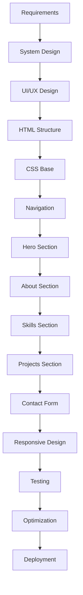

# Portfolio Website - Project Plan and Timeline

## Document Information
- **Project Name**: Personal Portfolio Website
- **Version**: 1.0
- **Date**: September 18, 2025
- **Status**: Draft

## 1. Project Overview

### 1.1 Project Summary
Development of a professional, responsive portfolio website to showcase skills, projects, and experience. The website will be hosted on GitHub Pages and follow modern web development best practices.

### 1.2 Project Objectives
- Create a professional online presence
- Showcase technical skills and projects
- Provide easy contact methods for potential employers/clients
- Demonstrate web development capabilities
- Establish a foundation for future enhancements

### 1.3 Project Scope
- **In Scope**: Single-page portfolio website with 7 main sections, responsive design, contact form integration, GitHub Pages deployment
- **Out of Scope**: Backend development, CMS integration, blog functionality, e-commerce features

## 2. Project Timeline

### 2.1 Project Phases Overview
```
Phase 1: Planning & Design     [Week 1: Sep 18-24]
Phase 2: Development          [Week 2-3: Sep 25-Oct 8]
Phase 3: Testing & QA         [Week 3: Oct 6-8]
Phase 4: Deployment           [Week 3: Oct 9]
Phase 5: Maintenance          [Ongoing]
```

### 2.2 Detailed Project Schedule

#### **Phase 1: Planning & Design (Week 1)**
**Duration**: 5 days (September 18-24, 2025)

| Task | Duration | Start Date | End Date | Deliverable |
|------|----------|------------|----------|-------------|
| Requirements Analysis | 1 day | Sep 18 | Sep 18 | Requirements Document |
| System Design | 1 day | Sep 19 | Sep 19 | Design Document |
| UI/UX Wireframes | 1 day | Sep 20 | Sep 20 | Wireframe Mockups |
| Content Preparation | 2 days | Sep 21 | Sep 22 | Content Assets |
| Development Environment Setup | 0.5 day | Sep 23 | Sep 23 | Dev Environment |
| Project Planning | 0.5 day | Sep 24 | Sep 24 | Project Plan |

**Milestones**:
- Requirements documented and approved
- System design completed
- UI/UX wireframes finalized
- All content assets prepared

#### **Phase 2: Development (Week 2-3)**
**Duration**: 10 days (September 25 - October 6, 2025)

| Task | Duration | Start Date | End Date | Dependencies | Deliverable |
|------|----------|------------|----------|--------------|-------------|
| HTML Structure | 1 day | Sep 25 | Sep 25 | Wireframes | HTML Framework |
| CSS Base Styles | 1 day | Sep 26 | Sep 26 | HTML Structure | Base CSS |
| Navigation Implementation | 1 day | Sep 27 | Sep 27 | CSS Base | Navigation Component |
| Hero Section | 1 day | Sep 30 | Sep 30 | Navigation | Hero Section |
| About Section | 1 day | Oct 1 | Oct 1 | Hero Section | About Section |
| Skills Section | 1 day | Oct 2 | Oct 2 | About Section | Skills Section |
| Projects Portfolio | 2 days | Oct 3 | Oct 4 | Skills Section | Projects Section |
| Contact Form | 1 day | Oct 5 | Oct 5 | Projects Section | Contact Section |
| Responsive Design | 1 day | Oct 6 | Oct 6 | All Sections | Responsive CSS |

**Milestones**:
- HTML structure complete
- Core styling implemented
- All sections functional
- Responsive design complete

#### **Phase 3: Testing & Quality Assurance (Week 3)**
**Duration**: 2 days (October 7-8, 2025)

| Task | Duration | Start Date | End Date | Dependencies | Deliverable |
|------|----------|------------|----------|--------------|-------------|
| Cross-browser Testing | 0.5 day | Oct 7 | Oct 7 | Development Complete | Test Results |
| Responsive Testing | 0.5 day | Oct 7 | Oct 7 | Development Complete | Device Testing |
| Performance Optimization | 0.5 day | Oct 8 | Oct 8 | Testing Complete | Optimized Code |
| Accessibility Testing | 0.5 day | Oct 8 | Oct 8 | Optimization Complete | Accessibility Report |

**Milestones**:
- All browsers tested and compatible
- Performance targets met
- Accessibility compliance verified

#### **Phase 4: Deployment (Week 3)**
**Duration**: 1 day (October 9, 2025)

| Task | Duration | Start Date | End Date | Dependencies | Deliverable |
|------|----------|------------|----------|--------------|-------------|
| GitHub Repository Setup | 0.25 day | Oct 9 | Oct 9 | Testing Complete | GitHub Repo |
| GitHub Pages Configuration | 0.25 day | Oct 9 | Oct 9 | Repository Setup | Live Website |
| Domain Configuration | 0.25 day | Oct 9 | Oct 9 | Pages Setup | Custom Domain |
| Final Testing | 0.25 day | Oct 9 | Oct 9 | Deployment Complete | Deployment Verification |

**Milestones**:
- Website live on GitHub Pages
- All functionality working in production
- Analytics and monitoring active

#### **Phase 5: Maintenance (Ongoing)**
**Duration**: Ongoing

| Task | Frequency | Effort | Deliverable |
|------|-----------|--------|-------------|
| Content Updates | Monthly | 2 hours | Updated Content |
| Security Updates | As needed | 1 hour | Security Patches |
| Performance Monitoring | Weekly | 30 minutes | Performance Reports |
| Bug Fixes | As needed | Variable | Bug Fixes |

## 3. Work Breakdown Structure (WBS)

### 3.1 WBS Hierarchy
```
1. Portfolio Website Project
   1.1. Planning & Analysis
       1.1.1. Requirements Gathering
       1.1.2. System Design
       1.1.3. UI/UX Design
       1.1.4. Content Strategy
   
   1.2. Development
       1.2.1. Frontend Development
           1.2.1.1. HTML Structure
           1.2.1.2. CSS Styling
           1.2.1.3. JavaScript Functionality
           1.2.1.4. Responsive Design
       1.2.2. Integration
           1.2.2.1. Form Integration
           1.2.2.2. Analytics Integration
           1.2.2.3. External Services
   
   1.3. Quality Assurance
       1.3.1. Testing
           1.3.1.1. Functional Testing
           1.3.1.2. Cross-browser Testing
           1.3.1.3. Performance Testing
           1.3.1.4. Accessibility Testing
       1.3.2. Optimization
           1.3.2.1. Code Optimization
           1.3.2.2. Image Optimization
           1.3.2.3. SEO Optimization
   
   1.4. Deployment
       1.4.1. Repository Setup
       1.4.2. CI/CD Configuration
       1.4.3. Production Deployment
       1.4.4. Domain Configuration
   
   1.5. Documentation
       1.5.1. Technical Documentation
       1.5.2. User Documentation
       1.5.3. Maintenance Guide
```

### 3.2 Task Dependencies



## 4. Resource Allocation

### 4.1 Human Resources
| Role | Resource | Allocation | Responsibilities |
|------|----------|------------|------------------|
| Project Manager | You | 20% | Planning, coordination, timeline management |
| UI/UX Designer | You | 15% | Design, wireframes, user experience |
| Frontend Developer | You | 50% | HTML, CSS, JavaScript development |
| QA Tester | You | 10% | Testing, quality assurance |
| DevOps Engineer | You | 5% | Deployment, monitoring setup |

### 4.2 Technical Resources
| Resource | Purpose | Cost | Notes |
|----------|---------|------|-------|
| Development Machine | Local development | $0 | Existing hardware |
| VS Code | Code editor | $0 | Free IDE |
| GitHub Account | Version control & hosting | $0 | Free tier |
| EmailJS | Contact form service | $0 | Free tier (up to 200 emails/month) |
| Google Analytics | Website analytics | $0 | Free service |
| Font Awesome | Icon library | $0 | Free version |

### 4.3 Time Allocation
| Phase | Estimated Hours | Percentage |
|-------|----------------|------------|
| Planning & Design | 40 hours | 25% |
| Development | 80 hours | 50% |
| Testing & QA | 24 hours | 15% |
| Deployment | 8 hours | 5% |
| Documentation | 8 hours | 5% |
| **Total** | **160 hours** | **100%** |

## 5. Risk Management

### 5.1 Risk Assessment Matrix

| Risk | Probability | Impact | Risk Level | Mitigation Strategy |
|------|-------------|--------|------------|-------------------|
| Content delays | Medium | Medium | Medium | Prepare placeholder content |
| Browser compatibility issues | Low | Medium | Low | Test early and often |
| Performance issues | Low | High | Medium | Implement optimization best practices |
| Design iterations | High | Low | Medium | Clear requirements and approval process |
| Technical learning curve | Medium | Medium | Medium | Allocate extra time for research |
| External service outages | Low | High | Medium | Have backup solutions ready |

### 5.2 Risk Mitigation Plans

#### 5.2.1 Content Delays
- **Prevention**: Set clear content deadlines
- **Mitigation**: Use placeholder content and Lorem ipsum
- **Contingency**: Launch with minimal content and update later

#### 5.2.2 Browser Compatibility
- **Prevention**: Use modern web standards and progressive enhancement
- **Mitigation**: Test on multiple browsers throughout development
- **Contingency**: Implement polyfills for critical features

#### 5.2.3 Performance Issues
- **Prevention**: Follow performance best practices from start
- **Mitigation**: Regular performance audits with Lighthouse
- **Contingency**: Optimize critical path and defer non-essential features

## 6. Quality Assurance Plan

### 6.1 Quality Standards
| Area | Standard | Measurement |
|------|----------|-------------|
| Performance | Lighthouse score > 90 | Automated testing |
| Accessibility | WCAG 2.1 AA compliance | Manual and automated testing |
| Responsive Design | Works on all common devices | Manual testing |
| Cross-browser | Works on Chrome, Firefox, Safari, Edge | Manual testing |
| Code Quality | Clean, commented, maintainable | Code review |

### 6.2 Testing Strategy
```
Unit Testing (JavaScript functions)
↓
Integration Testing (Component interactions)
↓
System Testing (End-to-end functionality)
↓
User Acceptance Testing (Manual walkthrough)
↓
Performance Testing (Lighthouse audits)
↓
Accessibility Testing (Screen reader testing)
```

## 7. Communication Plan

### 7.1 Stakeholder Communication
| Stakeholder | Role | Communication Method | Frequency |
|-------------|------|---------------------|-----------|
| Self (Developer) | All roles | Internal notes | Daily |
| Future Employers | End users | Live website | Continuous |
| GitHub Community | Reviewers | Repository README | One-time |

### 7.2 Progress Reporting
- **Daily**: Personal progress tracking
- **Weekly**: Milestone completion review
- **Phase End**: Deliverable review and approval

## 8. Change Management

### 8.1 Change Control Process
1. **Change Request**: Document requested change
2. **Impact Analysis**: Assess impact on timeline, resources, quality
3. **Approval**: Self-approval for minor changes, formal process for major changes
4. **Implementation**: Execute approved changes
5. **Verification**: Test and validate changes

### 8.2 Change Categories
| Type | Approval Required | Timeline Impact |
|------|------------------|-----------------|
| Content Updates | None | None |
| Minor Design Changes | Self | Minimal |
| Feature Additions | Self (with impact analysis) | Moderate |
| Technical Architecture Changes | Self (with redesign) | Significant |

## 9. Success Criteria

### 9.1 Project Success Metrics
| Metric | Target | Measurement Method |
|--------|--------|-------------------|
| Timeline Adherence | 100% on-time delivery | Project schedule tracking |
| Quality Standards | All standards met | Testing results |
| Budget Adherence | $0 cost (free hosting) | Financial tracking |
| Functionality | All requirements implemented | Requirements traceability |

### 9.2 Post-Launch Success Metrics
| Metric | Target | Timeline |
|--------|--------|----------|
| Page Load Speed | < 3 seconds | Immediate |
| Mobile Responsiveness | 100% functional | Immediate |
| Contact Form Submissions | > 0 inquiries/month | Within 3 months |
| Google Analytics Setup | Active tracking | Immediate |

## 10. Project Deliverables

### 10.1 Primary Deliverables
| Deliverable | Description | Due Date |
|-------------|-------------|----------|
| Live Portfolio Website | Fully functional website on GitHub Pages | Oct 9, 2025 |
| Source Code Repository | Complete codebase with version control | Oct 9, 2025 |
| Technical Documentation | Complete SDLC documentation | Oct 9, 2025 |
| User Guide | Instructions for updates and maintenance | Oct 9, 2025 |

### 10.2 Supporting Deliverables
| Deliverable | Description | Due Date |
|-------------|-------------|----------|
| Wireframes | UI/UX design mockups | Sep 22, 2025 |
| Content Assets | Images, resume, copy | Sep 22, 2025 |
| Test Results | QA testing documentation | Oct 8, 2025 |
| Performance Report | Optimization and speed analysis | Oct 8, 2025 |

## 11. Post-Project Activities

### 11.1 Project Closure
- [ ] Final deliverable review
- [ ] Project documentation complete
- [ ] Knowledge transfer (self-documentation)
- [ ] Lessons learned documentation
- [ ] Project archive and backup

### 11.2 Ongoing Maintenance
| Activity | Schedule | Effort |
|----------|----------|--------|
| Content updates | Monthly | 2 hours |
| Security monitoring | Quarterly | 1 hour |
| Performance review | Quarterly | 2 hours |
| Feature enhancements | As needed | Variable |

## 12. Tools and Resources

### 12.1 Project Management Tools
- **Planning**: Markdown files and todo lists
- **Time Tracking**: Manual logging
- **Version Control**: Git/GitHub
- **Documentation**: Markdown files

### 12.2 Development Tools
- **IDE**: Visual Studio Code
- **Browser Testing**: Chrome DevTools, Firefox Developer Tools
- **Performance**: Google Lighthouse
- **Design**: Figma (for wireframes)

---

**Project Sign-off**

| Role | Name | Signature | Date |
|------|------|-----------|------|
| Project Manager | [Your Name] | | |
| Developer | [Your Name] | | |
| Quality Assurance | [Your Name] | | |

**Document History**

| Version | Date | Author | Changes |
|---------|------|--------|---------|
| 1.0 | 2025-09-18 | [Your Name] | Initial project plan and timeline |